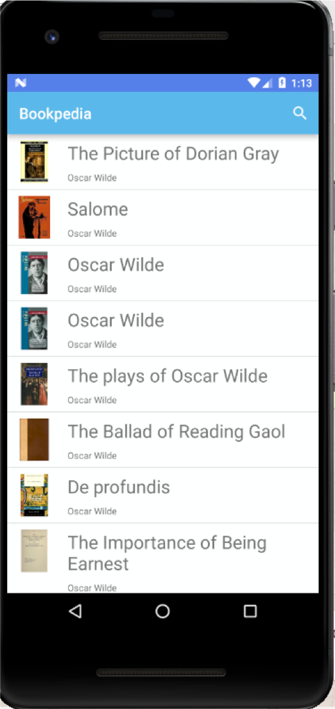
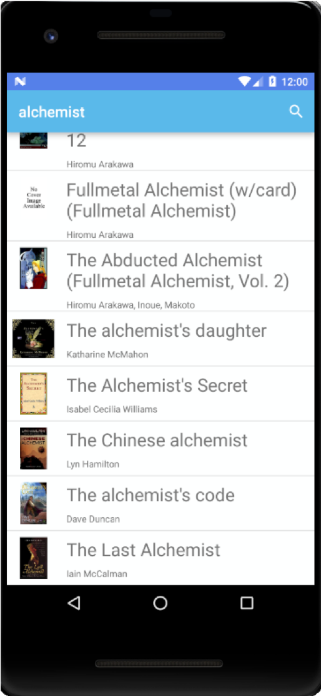
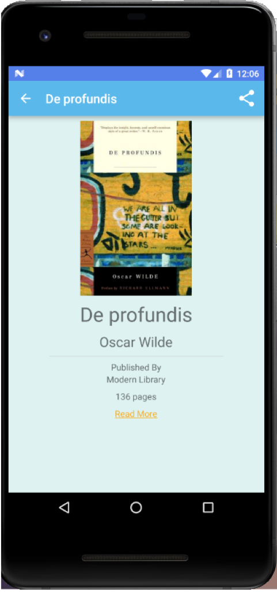
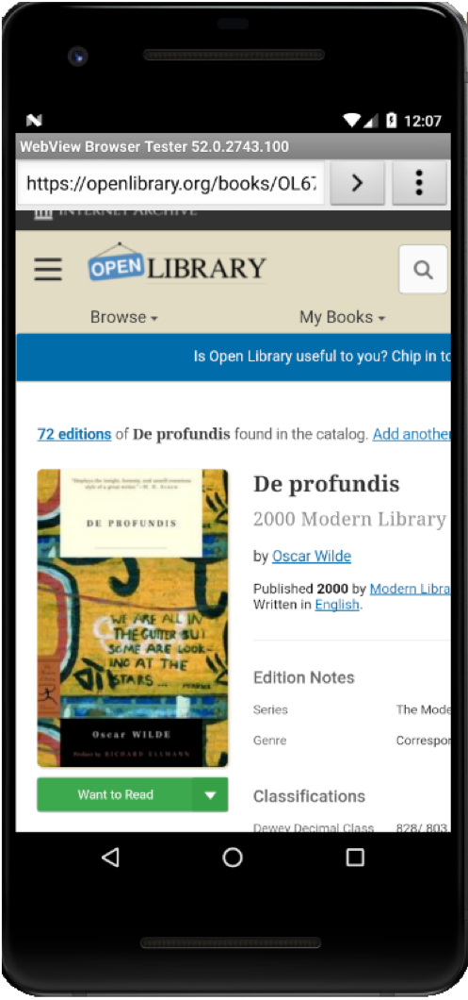
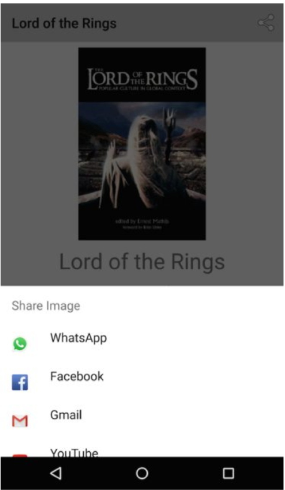

# Bookpedia

## About App:
The App uses OpenLibrary API to display information from the book repository. It uses REST APIs to link Open Library data in JSON format. The App has recommendation and share options to allow users to share book details through WhatsApp, Gmail and other installed Apps facilitating image and link sharing.

## List view

## Book Search

## View Book details

## Link to buy/read 

## Share book details

